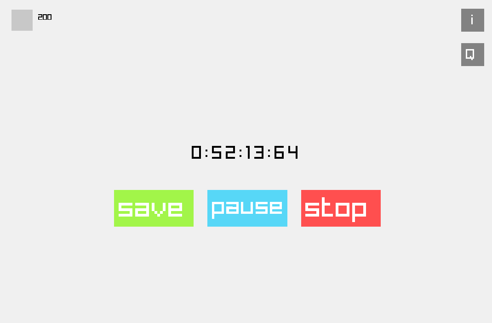

# Track how much time you are spending working!

This is a simple project I made mostly to finally finish something:P
Other than that I wanted to know how much time I spend programming each session

## hotkeys:
- F - start/stop the timer
- S - save
- P - pause/unpause
- I - check all of your logged sessions
- Q - check your ques tower
IN QUE TOWER SCREEN
-Up Arrow- go up in que tower
-Down Arrow- go down in que tower
-R - regenerate the color of individual que cubes

## Ques:
The program has a collectible called 'que' or 'ques'. Every hour you spend working you get an
extra que. You can check how many ques you've got in the que tower screen

If you want to save your session you HAVE TO press S. Pressing F after starting the timer
will delete the record

